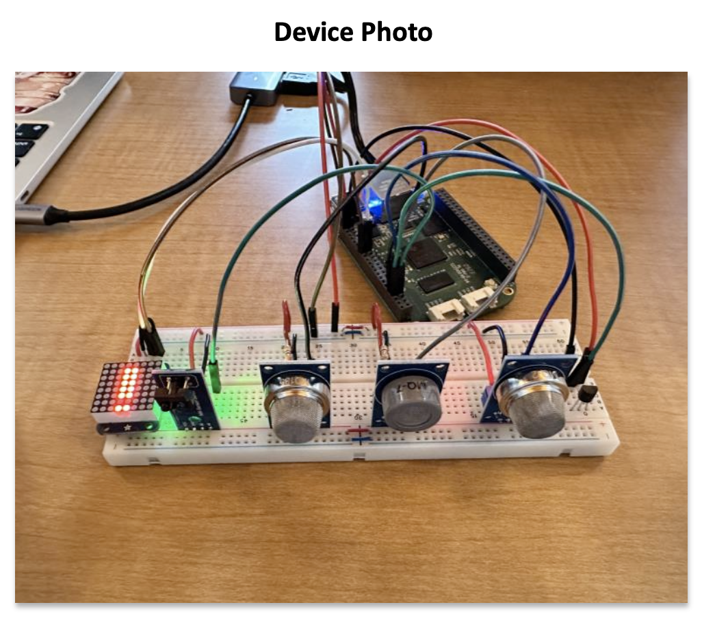

# Advanced Smoke Detector

Welcome to the **backend code** repository of Advanced Smoke Detector.

-   This project was worked on by a team of four individuals, with each member contributing to different aspects. I was responsible for the backend development.

-   Initial Prototype Demo:

## Description

Advanced Smoke Detector is a **multi-purpose fire and gas detector designed to mitigate false alarms** commonly triggered by modern detectors. Inspired by personal experiences of inconvenience caused by false fire alarms, the system integrates **multiple sensors**, including TMP36 for temperature, MQ-2 for flammable gas and smoke, MQ-7 for carbon monoxide (CO), MQ-135 for other harmful gases, and TCRT5000 infrared (IR) light sensor. These sensors are connected to a BeagleBone board, where multi-threaded functions written in C continuously sample, calculate, and display readings. By analyzing sensor data, the system determines whether to issue warnings or full alarms, ensuring accurate detection of hazards. Additionally, an IR sensor monitors obstructions and alerts users accordingly. Alarms and warnings are displayed through the terminal and LED matrix, enhancing user awareness and safety.

-   What was your motivation?    
    My motivation stemmed from personal experiences of enduring false alarms during cooking and baking, which often led to inconvenience and, at times, forced evacuations due to apartment procedures. These experiences inspired the creation of an advanced smoke detector and gas sensor, aiming to enhance safety and alleviate the disruptions caused by erroneous alarms.

## Table of Contents

-   [Description](#description)
-   [Outline](#outline)
-   [Features](#features)
-   [Results and Discussion](#results-and-discussion)
    -   [Learning Experience](#learning-experience)
        -   [Server-Side Coding](#server-side-coding)
        -   [BeagleBone Usage](#beaglebone-usage)
        -   [Embedded Real-Time Software](#embedded-real-time-software)
        -   [Multi-Threading](#multi-threading)
        -   [Working with Different Sensors](#working-with-different-sensors)
    -   [Challenges Faced](#challenges-faced)
        -   [Time Management and Task Division Challenges](#time-management-and-task-division-challenges)
    -   [Lesson Learned](#lesson-learned)
    -   [Credits](#credits)
-   [License](#license)
-   [Badges](#badges)
-   [How to Contribute](#how-to-contribute)

## Outline

-   For prototyping, [Arudino](https://www.arduino.cc) was initially used.
-   Incorporates [BeagleBone](https://www.beagleboard.org/boards/beaglebone-original) board as the central processing unit for the Multi-Purpose Fire & Gas Detector project.
-   Sensor code written in [C](https://en.wikipedia.org/wiki/C_(programming_language)#:~:text=C%20is%20an%20imperative%20procedural,all%20with%20minimal%20runtime%20support.) utilizing [multi-threaded](https://en.wikipedia.org/wiki/Multithreading_(computer_architecture)#:~:text=In%20computer%20architecture%2C%20multithreading%20is,This%20approach%20differs%20from%20multiprocessing.) functions.
-   Backend code written in [JavaScript](https://en.wikipedia.org/wiki/JavaScript) with [Node.js](https://nodejs.org/en) and [Express.js](https://expressjs.com).
-   Incorporates multiple sensors including TMP36, MQ-2, MQ-7, MQ-135, and TCRT5000 infrared (IR) light sensor for measuring temperature, detecting flammable gas, smoke, carbon monoxide (CO), other harmful gases, and monitoring obstruction.
-   Usage of LED matrix for displaying number of sensors gone off.

## Features

Warning & Alarm Features

Displaying live warnings and alarams via LED Matrix and Website

 

## Results and Discussion

### Learning Experience

#### Server-Side Coding

Our project involved setting up a server for displaying live sensor readings and issuing alarms or warnings to users via email. This experience familiarized us with server-side coding practices, including implementing APIs, handling client-server communication, and managing data transmission between embedded systems and online servers.

#### BeagleBone Usage

Our project provided invaluable insights into the practical application of BeagleBone in embedded real-time software development. By leveraging BeagleBone's capabilities as a versatile development platform, we were able to interface with multiple sensors, process sensor data in real-time, and execute complex multi-threaded functions efficiently.

#### Embedded Real-Time Software

Working with BeagleBone taught us the intricacies of developing embedded real-time software systems. We gained hands-on experience in writing C code optimized for real-time processing, ensuring timely data acquisition, analysis, and response to sensor inputs.

#### Multi-Threading

The implementation of multi-threaded functions on BeagleBone enabled concurrent execution of tasks, enhancing system performance and responsiveness. Through careful synchronization and resource management, we effectively utilized BeagleBone's multi-core architecture to handle sensor data processing efficiently.

#### Working with Different Sensors

Integrating various sensors into our project broadened our understanding of sensor technologies and their applications in real-world scenarios. By working with sensors such as TMP36, MQ-2, MQ-7, MQ-135, and TCRT5000, we gained practical insights into sensor selection, calibration, and data interpretation, enriching our knowledge of sensor-based systems.

### Challenges Faced

#### Time Management and Task Division Challenges

As this project marked our first venture into embedded software development, managing time effectively and dividing tasks efficiently presented notable challenges. Navigating the learning curve associated with embedded systems required careful planning and coordination to ensure timely completion of tasks and project milestones. Despite these challenges, our team successfully collaborated and adapted our approach, ultimately enhancing our skills in project management and teamwork.

### Lesson Learned

Our experience with the Multi-Purpose Fire & Gas Detector project taught us valuable lessons in perseverance, adaptability, and teamwork. We learned to navigate new technological challenges by working together efficiently and remaining flexible in our approach. Through this journey, we not only enhanced our technical skills but also gained a deeper understanding of the iterative nature of innovation. Overall, the project underscored the importance of hands-on experience and collaborative problem-solving in real-world engineering endeavors.

## Credits

-   This project was a collaborative effort involving a team of four individuals, each contributing to different aspects of the development and implementation: Robert Truong, Aneel Badesha, Kesley Rana, and Jaehong Lee. 

-   Credit is attributed to the referenced document titled "[TMP36 Temperature Sensor Guide for BeagleBone Green](https://opencoursehub.cs.sfu.ca/bfraser/grav-cms/cmpt433/links/files/2022-student-howtos/TMP36TemperatureSensor.pdf)" for providing guidance and inspiration in the creation of this TMP36 Temperature Sensor Guide for BeagleBone Green.

-   <a href="https://giphy.com/gifs/regalmovies-minions-breaking-despicable-me-eImrJKnOmuBDmqXNUj" title="Breaking Despicable Me GIF By Regal">PBreaking Despicable Me GIF By Regal</a>

## License

This project is licensed under the MIT License - see the [LICENSE.md](./LICENSE.md) file for details

## Badges

-   
-   
-   
-   
-   
-   
-   
-   
-   
-   

## How to Contribute

If you would like to provide any feedback or contribute to the project feel free to contact me via my email: ja34luv@gmail.com.
